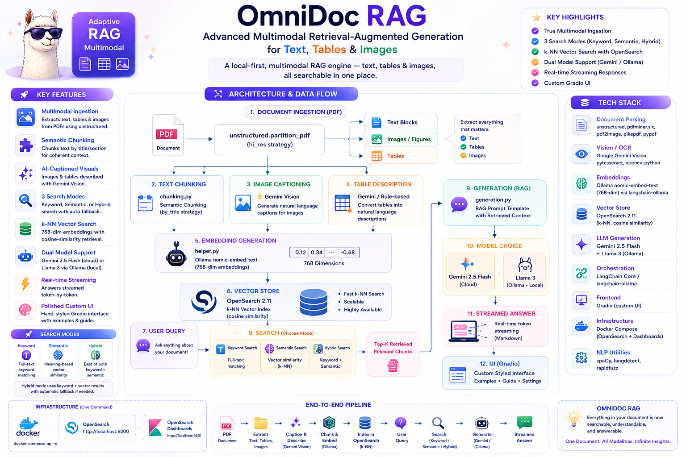
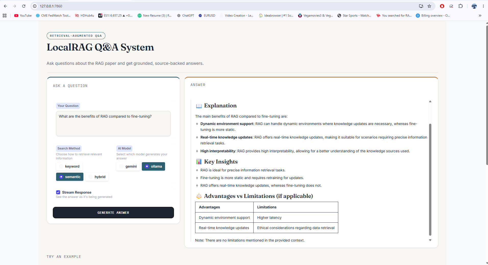
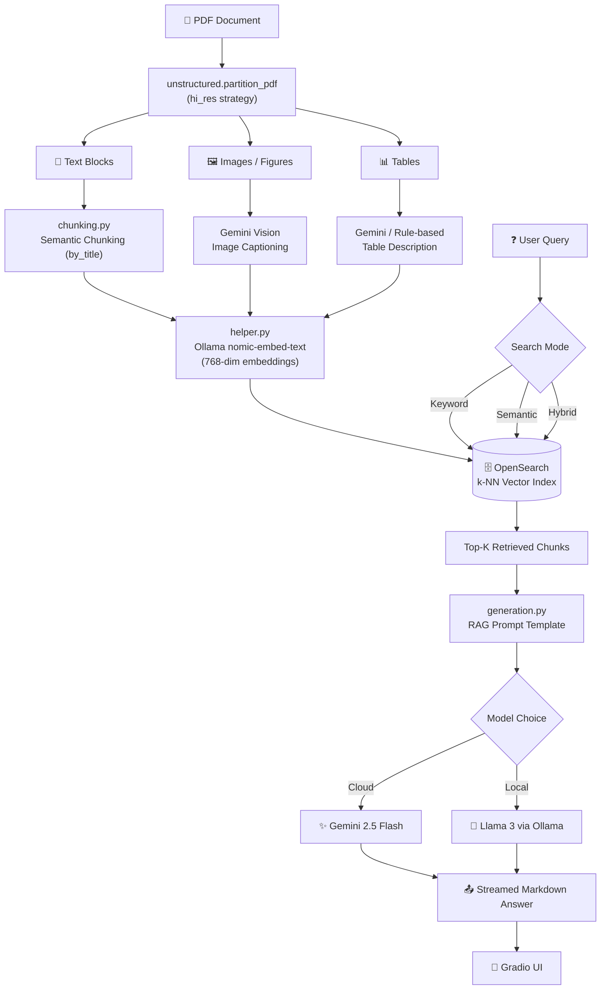

<div align="center">

# 🧠 **OmniDoc RAG: Advanced Multimodal Retrieval-Augmented Generation for Text, Tables & Images**

### *A local-first, multimodal Retrieval-Augmented Generation engine — text, tables & images, all searchable in one place.*



</div>

---

## 📖 Overview

**Advance RAG MultiModal** is an end-to-end Retrieval-Augmented Generation (RAG) pipeline that goes beyond plain text. It parses PDFs into **text, tables, and images**, embeds every piece of content, indexes it in **OpenSearch** with **k-NN vector search**, and then answers your questions using either **Google Gemini** or a **local Ollama model** — all wrapped in a clean, custom-styled **Gradio** chat interface.

Instead of treating a document as a wall of text, this project extracts figures, captions them with a vision-capable LLM, describes tables in natural language, and semantically chunks the remaining text — so nothing valuable gets lost in translation. 🚀

> 💡 Ask a question like *"Explain RAG architecture with diagrams"* and get an answer grounded in the actual figures and tables extracted from your source PDF — not just its raw text.

---

## ✨ Key Features

| | Feature | Description |
|---|---|---|
| 🖼️ | **True Multimodal Ingestion** | Extracts text, tables, and images from PDFs using `unstructured`'s high-resolution partitioning strategy |
| 🧩 | **Smart Semantic Chunking** | Chunks text by title/section with configurable size limits for coherent context windows |
| 🏷️ | **AI-Captioned Visuals** | Images and tables are described using **Gemini Vision**, turning figures into searchable natural-language content |
| 🔍 | **3 Search Modes** | Choose between **Keyword**, **Semantic (vector)**, or **Hybrid** search — with automatic fallback if hybrid fails |
| ⚡ | **k-NN Vector Search** | 768-dimension embeddings indexed in OpenSearch for fast cosine-similarity retrieval |
| 🤖 | **Dual Model Support** | Generate answers with **Gemini 2.5 Flash** (cloud) or **Llama 3 via Ollama** (fully local & private) |
| 📡 | **Real-time Streaming** | Watch answers generate token-by-token in the UI |
| 🎨 | **Polished Custom UI** | A hand-styled Gradio interface — not the default theme — with example prompts and a "how-to" guide baked in |
| 🐳 | **One-Command Infra** | OpenSearch + OpenSearch Dashboards spin up instantly via Docker Compose |

---

## 🖥️ App in Action

<div align="center">

</div>

---

## 🏗️ Architecture



---

## 🧰 Tech Stack

<div align="center">

| Layer | Technology |
|---|---|
| **Document Parsing** | `unstructured`, `pdfminer.six`, `pdf2image`, `pikepdf`, `pypdf` |
| **Vision / OCR** | Google Gemini Vision, `pytesseract`, `opencv-python` |
| **Embeddings** | Ollama `nomic-embed-text` (768-dim) via `langchain-ollama` |
| **Vector Store** | OpenSearch 2.11 (k-NN, cosine similarity) |
| **LLM Generation** | Gemini 2.5 Flash · Llama 3 (Ollama) |
| **Orchestration** | LangChain Core / `langchain-ollama` |
| **Frontend** | Gradio (custom CSS theme) |
| **Infra** | Docker Compose (OpenSearch + OpenSearch Dashboards) |
| **NLP Utilities** | spaCy, langdetect, rapidfuzz |

</div>

---

## 📂 Project Structure

```
Advance-RAG-MultiModal/
├── app.py                    # 🎨 Gradio UI — the main entry point for chatting
├── ingestion.py               # 📥 PDF → chunks → embeddings → OpenSearch index
├── chunking.py                 # 🧩 Semantic chunking + image/table captioning logic
├── retrieval.py                # 🔍 Keyword / Semantic / Hybrid search functions
├── generation.py               # 🤖 RAG prompt template + Gemini/Ollama generation
├── helper.py                   # 🔧 Embedding + OpenSearch client utilities
├── docker-compose.yml          # 🐳 OpenSearch + Dashboards services
├── processed_images.json       # 🖼️ Cached image captions (avoids re-calling Gemini)
├── processed_tables.json       # 📊 Cached table descriptions
├── dev.ipynb                   # 🧪 Notebook for experimentation
├── requirements.txt / pyproject.toml
└── Files/                      # 📁 Place your source PDF(s) here
```

---

## ⚙️ Getting Started

### 1️⃣ Prerequisites

- 🐍 Python 3.11+
- 🐳 Docker & Docker Compose
- 🦙 [Ollama](https://ollama.com/) installed locally (for embeddings + optional local generation)
- 🔑 A Google Gemini API key ([Get one here](https://ai.google.dev/))

### 2️⃣ Clone & Install

```bash
git clone https://github.com/paras160500/Advance-RAG-MultiModal.git
cd Advance-RAG-MultiModal

# Using pip
pip install -r requirements.txt

# OR using uv (recommended — this project ships a uv.lock)
uv sync
```

### 3️⃣ Pull the required Ollama models

```bash
ollama pull nomic-embed-text
ollama pull llama3
```

### 4️⃣ Configure environment variables

Create a `.env` file in the project root:

```env
GEMINI_API_KEY=your_gemini_api_key_here
```

### 5️⃣ Spin up OpenSearch

```bash
docker-compose up -d
```

This launches:
- 🗄️ **OpenSearch** → `http://localhost:9200`
- 📊 **OpenSearch Dashboards** → `http://localhost:5601`

### 6️⃣ Add your PDF & run ingestion

Drop your source PDF into the `Files/` directory (default expects `research_paper.pdf`), then run:

```bash
python ingestion.py
```

This will:
1. Partition the PDF into text, images, and tables
2. Caption images & describe tables (via Gemini)
3. Create semantic chunks from the remaining text
4. Embed everything and push it into the `pdf_content_index` in OpenSearch

### 7️⃣ Launch the app 🎉

```bash
python app.py
```

Open the local Gradio URL printed in your terminal and start asking questions!

---

## 🎮 How to Use the App

1. **Type your question** in the input box
2. Pick a **Search Method**:
   - 🔤 `Keyword` — classic full-text match
   - 🧠 `Semantic` — meaning-based vector search
   - 🔀 `Hybrid` — best of both worlds
3. Pick an **AI Model**:
   - ✨ `Gemini` — fast, cloud-hosted, needs an API key
   - 🦙 `Ollama` — fully local & private (Llama 3)
4. Toggle **Stream Response** to watch the answer generate live
5. Hit **Generate Answer** — or try one of the built-in example prompts!

---

## 🗺️ Roadmap

- [ ] Support multi-document ingestion & filtering by source file
- [ ] Add reranking step for retrieved chunks
- [ ] Dockerize the full app (not just OpenSearch)
- [ ] Add evaluation harness for retrieval quality
- [ ] Support additional vector stores (FAISS, Qdrant)

---

## 🤝 Contributing

Contributions, issues, and feature requests are welcome!
Feel free to check the [issues page](https://github.com/paras160500/Advance-RAG-MultiModal/issues) or open a pull request. ⭐ Star the repo if you find it useful!

---

## 📜 License

This project is open-sourced under the **MIT License**. See the [LICENSE](LICENSE) file for details.

---

<div align="center">

**Built with ❤️ by [Paras Patel](https://github.com/paras160500)**

*If this project helped you, consider giving it a ⭐!*

</div>